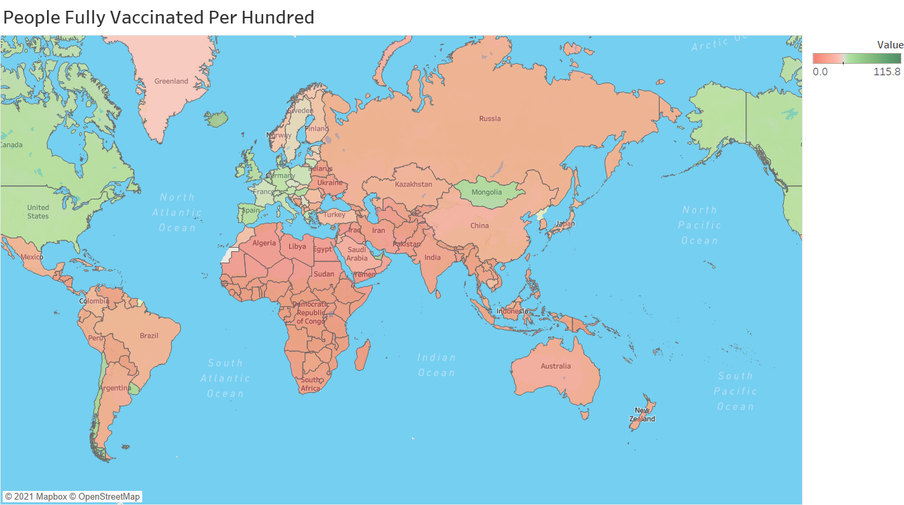
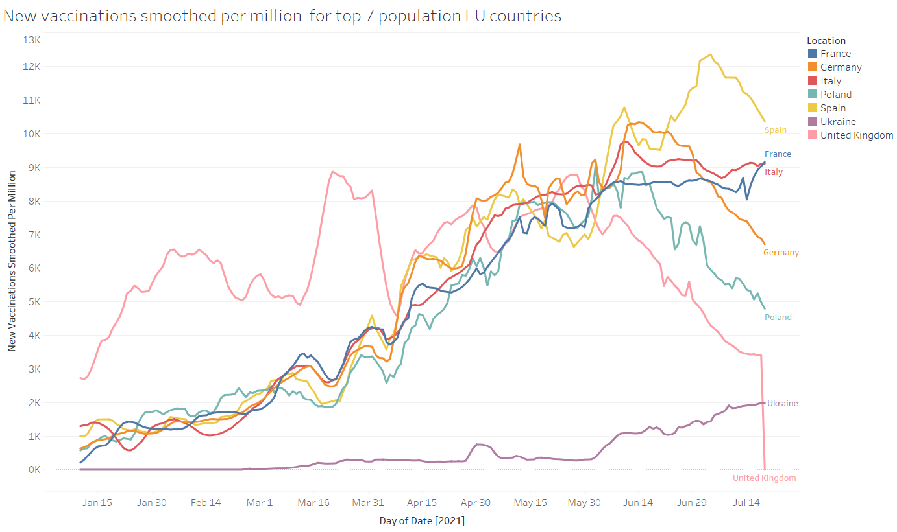
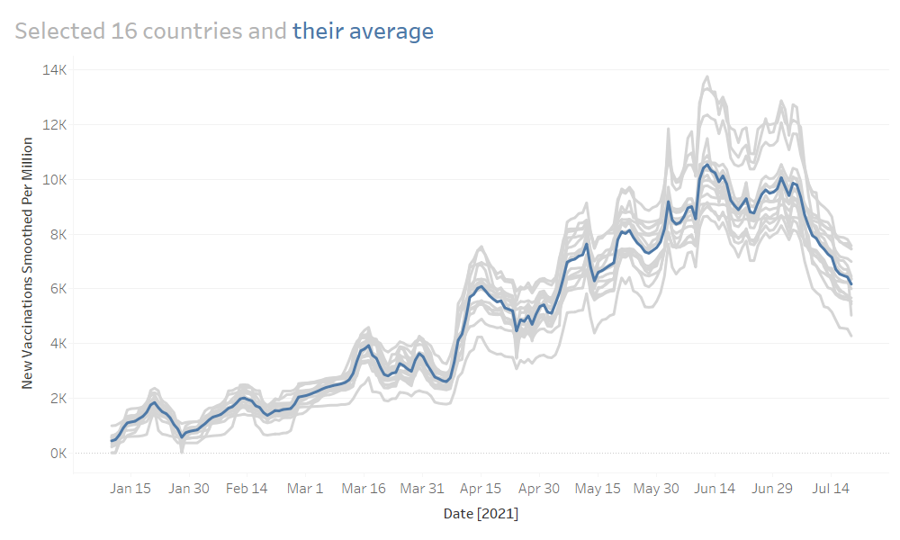

# COVID-19 Vaccination Data Visualization
## Basic info
Data source: [Data on COVID-19 (coronavirus) by Our World in Data](https://github.com/owid/covid-19-data/tree/master/public/data) up to 7/19/2021.

Tools: 
* Data processing: Microsoft SQL Server Management & excel
* Visualization: flourish & tableau

## Feature analysis
First, let us go through the columns in the total data sets, which can be divided into the following categories: 
* cases: (smoothed) total/new cases/deaths (per million)

* epidemiology: 
reproduction rate
stringency Index: 0 - 100, A higher score indicates a stricter response
population (density)
median_age, aged 65/70 older  

* patients: (weekly) ICU/hospital patients (per million)
weekly ones

* tests: (smoothed) new/total tests (per thousand), positive rate, tests per case

* vaccination: (smoothed) total/new vaccinations (per hundred), people (fully) vaccinated (per hundred), 

* facility: handwashing facilities, hospital beds per thousand

* other: GDP per capita, extreme poverty, other disease rates, life_expectancy, human develpoment_index

We are interested in the vaccination data in this project, and if necessary, we can consider the correlation between the other data above and vaccination.

## Vaccination data analysis
All data columns: `total_vaccinations`, `people_vaccinated`, `people_fully_vaccinated`, `new_vaccinations`, `new_vaccinations_smoothed,` `total_vaccinations_per_hundred,` `people_vaccinated_per_hundred`, `people_fully_vaccinated_per_hundred`, `new_vaccinations_smoothed_per_million`.

For the comparison between countries, we focus on the total vaccinations, not the new vaccination per day.

The available options are: `total_vaccinations,` `total_vaccinations_per_hundred`, `people_vaccinated`, `people_fully_vaccinated`, `people_vaccinated_per_hundred`,   `people_fully_vaccinated_per_hundred`

The indicator that best reflects the coverage of vaccination is `people_fully_vaccinated_per_hundred`. 

However, the statistical data types of different countries are different, which leads to some columns with many missing values. Let's also choose `total_vaccinations_per_hundred` with the fewest missing values to study.

Here is the bar chart race of `total_vaccinations_per_hundred` data starting from 1/10/2021.

We can find that many top-ranked countries are countries with small populations, so we divide the data of `people_fully_vaccinated_per_hundred` into top 50% population and lower 50% population as follows.

Analysis (undone):
1. Gibraltar
2. Eu and north America

Next, we make the Geographical distribution plot of `people_fully_vaccinated_per_hundred`.

Analysis:
Vaccine coverage in Europe and North America is higher.

So let's take a look at the vaccination process in Europe. The time series plot of `new_vaccinations_smoothed_per_million` for the seven most populous countries in Europe is as follows.

Except for the United Kingdom and Ukraine, the vaccination process in the other 5 countries is similar, with a gradual increase from January to May 2021, and then a decline.

Next, we check if other European countries have similar patterns, and the answer is yes. We select 16 countries with the pattern: Austria, Belgium, Croatia, Czechia, Finland, France, Germany, Greece, Italy, Lithuania, Netherlands, Norwat, Poland, Spain, Sweden, and Switzerland. Their time series and the average are shown below.

## Tech details
### Bar chart race plot
* NOT COMPLETED
1. Copy the query results from the SQL server to excel and save the document.
    * Replace NULL with 0.
    * Rank the columns and rows
    * Add continent to the table
2. Make the bar chart race at [flourish](https://flourish.studio/).
