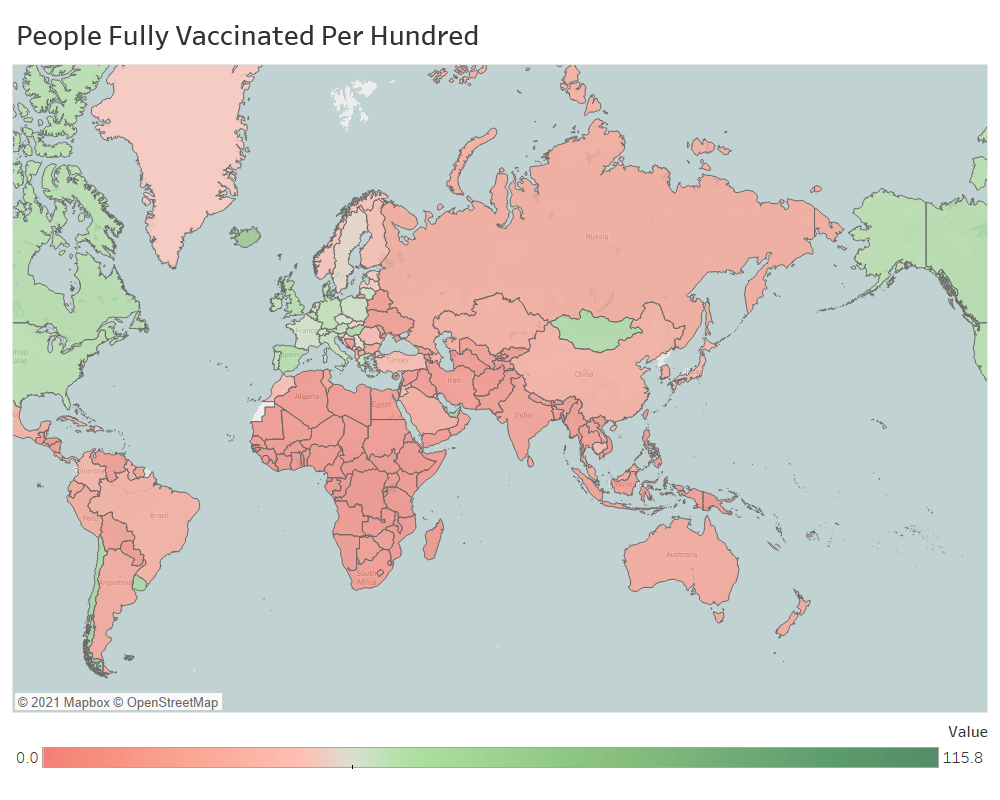

# COVID-19 Vaccination Data Visualization

## Basic info

In this project, we visualize and analyze the COVID-19 vaccination data in countries all over the world, especially European countries.

Data source: [Data on COVID-19 (coronavirus) by Our World in Data](https://github.com/owid/covid-19-data/tree/master/public/data) up to 7/19/2021.

Tools: 
* Data processing: Microsoft SQL Server Management & excel
* Visualization: flourish & tableau

## Feature analysis

First, let us go through the columns in the total data sets, which can be divided into the following categories: 
* cases: (smoothed) total/new cases/deaths (per million)

* epidemiology: 
reproduction rate
stringency Index: 0 - 100, A higher score indicates a stricter response
population (density)
median_age, aged 65/70 older  

* patients: (weekly) ICU/hospital patients (per million)

* tests: (smoothed) new/total tests (per thousand), positive rate, tests per case

* vaccination: (smoothed) total/new vaccinations (per hundred), people (fully) vaccinated (per hundred), 

* facility: handwashing facilities, hospital beds per thousand

* other: GDP per capita, extreme poverty, other disease rates, life_expectancy, human develpoment_index

We are interested in the vaccination data in this project, and if necessary, we can consider the correlation between the other data above and vaccination.

## Vaccination data analysis

All data columns: `total_vaccinations`, `people_vaccinated`, `people_fully_vaccinated`, `new_vaccinations`, `new_vaccinations_smoothed,` `total_vaccinations_per_hundred,` `people_vaccinated_per_hundred`, `people_fully_vaccinated_per_hundred`, `new_vaccinations_smoothed_per_million`.

For the comparison between countries, we focus on the total vaccinations, not the new vaccination per day.

The available options are: `total_vaccinations,` `total_vaccinations_per_hundred`, `people_vaccinated`, `people_fully_vaccinated`, `people_vaccinated_per_hundred`,   `people_fully_vaccinated_per_hundred`

The indicator that best reflects the coverage of vaccination is `people_fully_vaccinated_per_hundred`. 

However, the statistical data types of different countries are different, which leads to some columns with many missing values. Let's also choose `total_vaccinations_per_hundred` with the fewest missing values to study.

### Choose the chart type

We want to study the vaccination process of countries around the world, but putting the data of more than two hundred countries and regions on one map will be a mess, so we only choose the top countries.

In addition, we also want to study the changes over time. If we use a time series plot, we may need to plot all the countries that were top at a certain time, which will still include many countries.

Considering the above factors, we choose a bar chart rase for visualization.

### Data process

The statistics of different timestamps are listed row by row in the dataset, but we need specific data with the timestamp in rows, which is the requirement for the Flourish bar chart race.  

We can use the **PIVIT** relational operator to perform it in SQL Server if the number of rows/timestamps is fixed and small. But if there are too many rows/timestamps (like in this case), we need to use **dynamic query**. You can find the tutorial [here](https://www.databasejournal.com/features/mssql/converting-rows-to-columns-pivot-and-columns-to-rows-unpivot-in-sql-server.html).

### Visualiztion results

Here is the bar chart race of `total_vaccinations_per_hundred` data starting from 1/10/2021.

We can find that many top-ranked countries are countries with small populations, so we divide the data of `people_fully_vaccinated_per_hundred` into top 50% population and lower 50% population as follows.

### Analysis 

* We surprisingly found out that the number of Gibraltar is more than 100, read the [news](https://www.standard.co.uk/news/uk/gibraltar-covid-vaccination-programme-entire-adult-population-b924942.html) for more details.
* The various color makes it hard to analyze, so we just focus on the European countries and get the following chart of `total_vaccinations_per_hundred`.

European countries were the first to be vaccinated, but starting in March, other countries have gradually caught up. About 10 of the top 25 countries are European countries from March.

What about the countries with the top 50% population?

More than half of the top 15 countries continue to be European countries, although there are only 6 European countries among the 30 most densely populated countries.

Next, we make the geographical distribution plot of `people_fully_vaccinated_per_hundred`.

Among the continents, the vaccine coverage in Europe and North America is higher. 
Let's take a closer look at the vaccination process in Europe. The time series plot of `new_vaccinations_smoothed_per_million` for the seven most populous countries in Europe is as follows.

Except for the United Kingdom and Ukraine, the vaccination process in the other 5 countries is similar, with a gradual increase from January to May 2021, and then a decline.

Next, we check if other European countries have similar patterns, and the answer is yes. We select 16 countries with the pattern: Austria, Belgium, Croatia, Czechia, Finland, France, Germany, Greece, Italy, Lithuania, Netherlands, Norway, Poland, Spain, Sweden, and Switzerland. Their time series of `new_vaccinations_smoothed_per_million` and their average are shown below.

